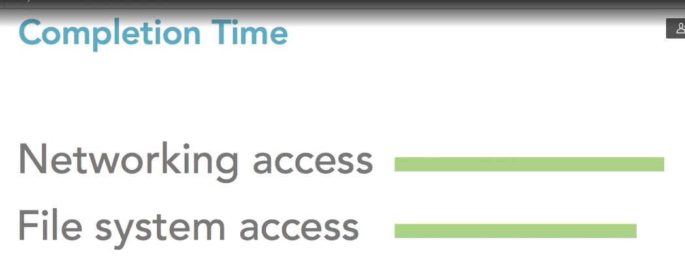

# linkedin learning node js course
[tutorial](https://www.linkedin.com/learning/learning-node-js-2017/)

# process completion time
  
- network and file system access are the most expensive operations

# Nodejs advantages
- share code thought front and back
  - custom logic of algorithm to be use in both, login, token, ...
- share algorithm
- share data structure
- JSON integration (JSON itself is a subject of javascript language)
- dynamic lang

# nodejs filesystem
## nodejs read directories

sync operation
```javascript
var fs=require("fs"); 
data = fs.readdirSync("./");
console.log("data: ", data);
```

async operation
```javascript
var fs=require("fs"); 
fs.readdir("./", (err, data) => {
    if(err){
      console.error(err);
      return;
    }

    console.log("data: ", data);
});

console.log("this is the end");
```

import own libraries
```javascript
//my-module.js
exports.name = "my name"

//app.js
var myModule = require("./my-module");
console.log(myModule.name);
```

## nodejs read files
```javascript

var fs=require("fs");
var package=require("./package.json");

fs.readFile("./package.json", "utf-8", (err, data) => {
    if(err){
      console.error(err);
      return;
    }

    console.log("data: ", data.toString());
});

fs.readFile("/sbin/halt", "binary", (err, data) => {
    if(err){
      console.error(err);
      return;
    }

    console.log("data: ", data.toString());
});
```

## nodejs write files
```javascript
var fs=require("fs");
var package=require("./package.json");
fs.writeFile("package2.json", JSON.stringify(package),(err) => {
    if(err){
      console.error(err);
    }
});
```

# npm commands
## npm install
- install a module in the folder
- it saves the module in the package directly
- you can specify a version using @

```shell
npm install package
npm install package@latest
```
## npm install -D
- install a dev dependency
- it saves the dependency for you

## npm uninstall

# npx commands
let you work with your internal tools

```shell
npx nodemon file.js
```

# Nodejs special variables, __dirname and __filename
```javascript
__dirname
```

# Nodejs web frameworks
[express](express)  

